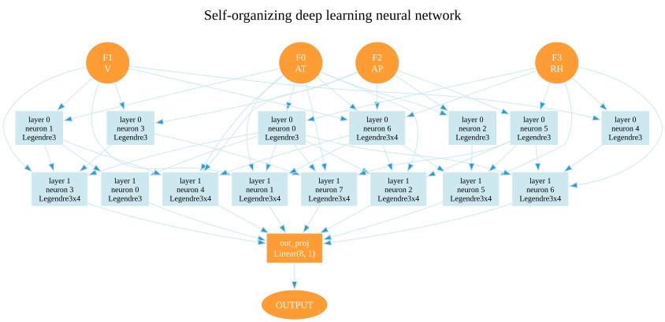

# TorchSONN

TorchSONN is a Python library implementing a self-organizing neural
network built on PyTorch. Layers of small neurons are grown one at a time;
each layer tries every pair (or tuple) of the previous layer's outputs
against a set of reference functions and keeps the top-k that minimize a
validation criterion. Training stops automatically when adding a layer no
longer reduces the criterion error. Three families of reference functions
are available:

- **Power-basis polynomials**: `linear`, `linear_cov`, `quadratic`,
  `cubic` and multi-input `polyquad`;
- **Orthogonal polynomials**: `legendre` and `chebyshev`, with a
  configurable degree and number of inputs. They stay well conditioned at
  higher degrees, where the raw power basis breaks down;
- **Gaussian radial basis functions**: `rbf`, local bumps whose centres and
  widths are initialized by k-means and then learned.

It is a GPU-accelerated extension of
[GmdhPy](https://github.com/kvoyager/GmdhPy), an earlier scikit-learn-style
library implementing the iterative Group Method of Data Handling (GMDH).
TorchSONN reimplements the same self-organizing algorithm on PyTorch,
bringing GPU acceleration to model training and inference.

## Plotting a model

A trained network can be drawn as a diagram with `torchsonn.plot_model`.
Each box is a neuron, and its incoming edges are the inputs it reads:

```python
from torchsonn.plot_model import PlotModel

PlotModel(model, filename="model", plot_neuron_name=True).plot()  # writes model.svg
```

This example is the pruned network from the
[CCPP tutorial](tutorials/ccpp/README.md), cut down to the neurons that
reach the output:

<details open>
<summary>Pruned CCPP network (click to collapse; click the image for full size)</summary>

<br>

<a href="img/ccpp_pruned_model.svg"></a>

</details>

Plotting needs the `viz` extra and the system Graphviz binaries (see
below).

## Install

The latest released version is on PyPI:

```bash
pip install torchsonn
```

The latest development version, from the `main` branch on GitHub:

```bash
pip install "git+https://github.com/kvoyager/torchsonn.git"
```

Plotting is opt-in via the `viz` extra, which adds `graphviz` (for the
`torchsonn.plot_model` network diagrams) and `matplotlib` (for
`SONN.plot_layer_error`):

```bash
pip install "torchsonn[viz]"
# or, from GitHub
pip install "torchsonn[viz] @ git+https://github.com/kvoyager/torchsonn.git"
```

`graphviz` additionally requires the system Graphviz binaries — `dot` must be
on your `PATH` (see [graphviz.org/download](https://graphviz.org/download/)).
Training and inference work without any of this.

For development, clone the repo and install editably:

```bash
git clone https://github.com/kvoyager/torchsonn.git
cd torchsonn
pip install -e ".[test]"
```

Requires Python 3.12+.

## Quickstart

```python
import numpy as np
from omegaconf import OmegaConf
from sklearn.datasets import fetch_california_housing
from sklearn.preprocessing import StandardScaler
from torch.utils.data import DataLoader

from torchsonn import SONN, SONNDataset, Trainer

# California housing regression — 8 features, target in units of $100k.
housing = fetch_california_housing()
x = housing.data.astype(np.float32)
y = housing.target.astype(np.float32)
feature_names = list(housing.feature_names)

# 50/25/25 train/dev/test split; z-score features on the train split only.
n = x.shape[0]
i_train, i_dev = int(0.50 * n), int(0.75 * n)
scaler = StandardScaler().fit(x[:i_train])

train_ds = SONNDataset(scaler.transform(x[:i_train]),      y[:i_train])
dev_ds   = SONNDataset(scaler.transform(x[i_train:i_dev]), y[i_train:i_dev])
test_ds  = SONNDataset(scaler.transform(x[i_dev:]),        y[i_dev:])

train_dl = DataLoader(train_ds, batch_size=8192, shuffle=True)
dev_dl   = DataLoader(dev_ds,   batch_size=8192)
test_dl  = DataLoader(test_ds,  batch_size=8192)

# Override only what differs from the schema defaults — everything else
# comes from torchsonn.config.SONNConfig.
config = OmegaConf.merge(
    SONN.default_config(),
    OmegaConf.create({
        "model": {
            "type": "regressor",
            "ref_functions": ["linear_cov"],
            "nbest_neurons": 8,
            "max_neuron_models": 28,
            "shortcut": True,
            "output_clamp_value": 1e6,
        },
        "train": {
            "criterion_type": "validate",
            "max_layer_count": 10,
            "optimizer": {"name": "lbfgs",
                          "optimizer_params": {"lr": 0.1, "history_size": 10}},
            "steps": 500,
            "batch_size": 8192,
        },
    }),
)

model = SONN(config, d_model=x.shape[1], feature_names=feature_names)
trainer = Trainer(config, feature_names=feature_names)
trainer.set_seed(config.train.seed)
trainer.train(model, train_dl, dev_dl, test_dl)

trainer.load_model_checkpoint(model, "cpu")

# Optional: strip the neurons that don't feed the best-error output.
# Inference returns one prediction per sample either way.
trainer.prune(model)

preds, targets = trainer.infer(model, test_dl)
mse = ((preds - targets) ** 2).mean().item()
mae = (preds - targets).abs().mean().item()
print(f"test MSE: {mse:.4f}  MAE: {mae:.4f}")
print(f"features used: {model.get_selected_features()}")
```

## Tutorials

Five end-to-end examples live under `tutorials/`, each with every config
key overridable on the command line:

```bash
# Iris classification — multi-class with soft binner, polyquad neurons.
python -m tutorials.iris.iris_recognition

# California housing regression — gmdhpy-equivalent setup with LBFGS.
python -m tutorials.california_housing.california_housing

# UCI Concrete compressive-strength regression — reports MSE / MAE / R².
python -m tutorials.concrete.concrete

# UCI Combined Cycle Power Plant regression — 5×2 cross-validation, reports
# mean ± std of RMSE / MAE / R² over the 10 folds (Tüfekci & Kaya benchmark).
python -m tutorials.ccpp.ccpp

# Otto Group product classification — multi-class log loss, out_proj fine-tune.
python tutorials/otto/otto_classification.py
```

Hydra overrides work on any field in the schema. A few useful ones:

```bash
# Resume from the last checkpoint
python -m tutorials.iris.iris_recognition resume=true

# Swap optimizer + tune its kwargs
python -m tutorials.california_housing.california_housing \
    train.optimizer.name=adam \
    train.optimizer.optimizer_params.lr=5e-3

# Redirect Hydra's per-run output directory
python -m tutorials.iris.iris_recognition hydra.run.dir=/tmp/sonn_run
```

The iris and otto tutorials also ship notebook versions
(`tutorials/iris/iris_recognition.ipynb` and `tutorials/otto/otto.ipynb`)
that render the layer-error curve, the confusion matrix, and the graphviz
network diagrams inline.

Every tutorial except `tutorials/otto/otto_classification.py` plots its
results, so they need the `[viz]` extra — iris, california_housing,
concrete, and ccpp render network diagrams (graphviz), and iris plus both
notebooks call `SONN.plot_layer_error` (matplotlib). The otto script runs on
a base install.

## Configuration

Defaults are defined as a typed dataclass at
`torchsonn.config.SONNConfig` (registered with Hydra's `ConfigStore`
under the name `default`). Tutorial YAMLs use the
`defaults: [default, _self_]` pattern, so each tutorial's YAML is just
the diff against the schema. Override hierarchy at compose time:

```
SONNConfig defaults  →  tutorial YAML  →  CLI overrides
```

Type-checked at compose time: unknown keys and wrong-typed values are
rejected before any training starts.

### Layer inputs (`model.shortcut`)

Every layer after the first always reads the outputs of the layer before
it. `model.shortcut` sets what else it reads:

```yaml
model:
  shortcut:
    raw_features: true   # re-feed the original features (default true)
    prev_layers: null    # also feed the outputs of this many layers
                         # before the previous one: null (default) = none,
                         # an int k, or "all"
```

With five layers built, the sixth reads layer 5 alone with
`prev_layers: null`, layers 5 and 4 with `1`, layers 5, 4 and 3 with `2`,
and every layer with `"all"`. The candidate count grows with the input
width, so `"all"` gets expensive deep in the network. `shortcut: true` /
`false` is shorthand for `{raw_features: true / false, prev_layers: null}`.
On the command line: `model.shortcut.prev_layers=2`.

## License

Released under the MIT License — see [LICENSE](LICENSE) for the full text.

## Citation

If you use TorchSONN in your research, please cite it as:

```bibtex
@software{kolokolov_torchsonn_2026,
  author    = {Kolokolov, Konstantin},
  title     = {{TorchSONN}: A {PyTorch} Implementation of the self-organizing polynomial neural network},
  year      = {2026},
  version   = {0.1.1},
  url       = {https://github.com/kvoyager/torchsonn},
  note      = {GitHub repository}
}
```

