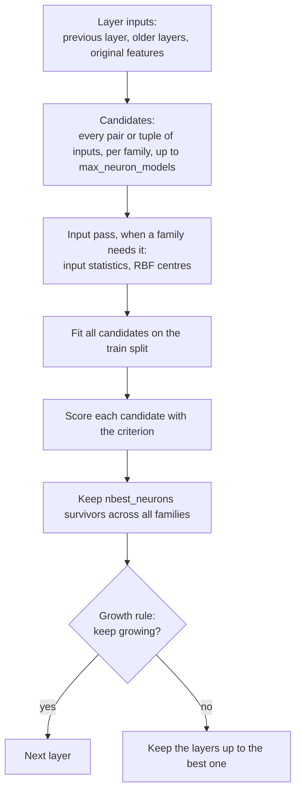
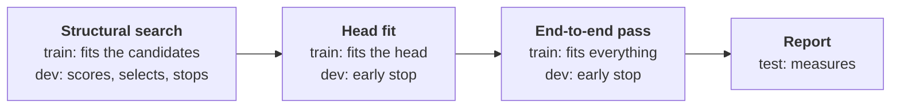

# The algorithm

`Trainer.train` grows a network one layer at a time. Each layer tries many
small candidate neurons, keeps the best few, and the search stops once new
layers stop helping. This page follows one layer through the code, then
the stop rule, then what happens after the search. [GMDH](gmdh.md) explains
the ideas behind the method; this page is how TorchSONN carries them out.

## Terms

| Term | Meaning |
|---|---|
| feature | One column of the model's input. |
| family | A kind of neuron, named in `model.ref_functions`: `linear_cov`, `legendre`, `rbf` and so on. |
| candidate | One neuron of a family on one pair (or tuple) of inputs, before selection. |
| survivor | A candidate that selection keeps; each layer keeps `nbest_neurons`. |
| layer | The survivors of one round of the search. |
| head | An optional linear layer over the last layer's survivors (`model.use_output_projection`). |
| train split | The rows that fit the candidates' coefficients. |
| dev split | The rows that score the candidates, select the survivors and decide the depth. It plays the part of GMDH's checking subset; the tutorials call it "validate". |
| validation split | Optional extra rows (`val_dl`) that select nothing. Their error is reported per layer. With `train.stop_source: val` they decide the depth and the end-to-end pass's early stop instead of dev. |
| test split | The rows that measure the finished model and nothing else. |

## One layer

### 1. Layer inputs

Layer 0 reads the features. Every later layer `j` reads a concatenation:

$$
\big[\, h_{j-1} \mid h_{j-2} \mid \dots \mid h_{j-1-k} \mid x \,\big]
$$

where $h_i$ holds the outputs of layer $i$'s survivors and $x$ the
features. The previous layer is always included. `model.shortcut` sets the
rest: `prev_layers` is $k$, the number of older layers also fed in (none by
default), and `raw_features` adds $x$ (on by default). Each layer stores
which layers it reads, because pruning can delete layers later.

In the [regression quickstart](../getting-started/quickstart-regression.md),
layer 0 reads 8 features, and every later layer reads 8 survivors plus the
8 features: 16 inputs.

### 2. Candidates

Each family in `model.ref_functions` makes one candidate per pair of inputs,
or per unordered tuple of `dim` inputs for the families that take more than
two. The order of the inputs inside a tuple does not matter, because each
family's formula treats its inputs symmetrically. 8 inputs make 28 pairs and
16 inputs make 120. When a family has more tuples than
`model.max_neuron_models`, it takes a random subset of that size, drawn
from the seeded random generator. A family that needs more inputs than the
layer has sits that layer out.

### 3. Input pass

Some families need to see the layer's inputs before they train. The
orthogonal families squash each input into $[-1, 1]$ using its mean and
standard deviation, and the RBF family places its centres by k-means. For
these, `Trainer.fit_layer_inputs` runs the frozen layers below over the
train split once, collects the statistics and, for RBF, a sample of up to
`train.input_sample_rows` rows. Layers whose families need none of this
skip the pass.

### 4. Fit

All candidates of one family train together as one batch: every
candidate's coefficients form one row of a batched parameter tensor, and
`torch.func.vmap` evaluates the loss for all of them at once. The batched
optimizers (`lbfgs`, `adam`, `sgd`, `newton`, `newton-lm`) update each
candidate independently. The loss is the squared error divided by the
variance of the training targets for regression, the negative
log-likelihood for multi-class and the binary cross-entropy for binary
models, plus an optional ridge penalty (`train.ridge_alpha`).

Every `train.eval_step_interval` steps, each candidate is evaluated on the
dev split. A candidate that stops improving first gets a smaller learning
rate and then stops; the fit ends when every candidate has stopped or the
step limit is reached. A candidate whose loss becomes NaN is dropped.
[Optimizers](../guides/optimizers.md) has the details.

### 5. Criterion

Each fitted candidate gets one number, its criterion value. With the
default `train.criterion_type: validate`, that is its error on the dev
split: for regression the squared error divided by the spread of the dev
targets around their mean,

$$
\Delta^2 = \frac{\sum_{i \in \text{dev}} (y_i - \hat{y}_i)^2}{\sum_{i \in \text{dev}} (y_i - \bar{y})^2},
$$

and for classification the cross-entropy divided by the entropy of the
class frequencies. Both are 1 for a model no better than the trivial
prediction and 0 for a perfect one. The `bias` criterion instead fits each
candidate twice, on the even and on the odd rows of the train split, and
measures how much the two fits disagree; `validate_bias` mixes the two.
[Criteria](criteria.md) gives every variant.

### 6. Selection

The candidates of all families in the layer compete together. With the
default `train.neuron_selection_method: plain`, the `nbest_neurons` with
the lowest criterion values survive; `omp_mixed` and `omp` also favour
survivors whose outputs differ from each other (see
[Survivor selection](selection.md)). Every other candidate is deleted. The
layer's error is its best survivor's criterion value
(`train.layer_err_criterion: top`), or their mean (`avg`).

Two options add a step here: `train.layer_finetune` retrains the survivors
jointly through a temporary head, and `train.layer_err_source: readout`
scores the layer by such a head instead of its best neuron (see
[Heads and fine-tuning](heads-and-finetune.md)).

## The growth rule

After each layer, the growth rule decides whether to build another. A layer
counts as an improvement when its error is lower than that of the last
layer that counted, by at least a margin:

$$
\text{margin} = \max\big(\delta,\ \varepsilon \cdot e_{\text{best}}\big)
$$

where $\delta$ is `train.stop_train_min_delta` (0 by default), $\varepsilon$
is `train.stop_train_epsilon_condition` (0.001 by default) and
$e_{\text{best}}$ is the lowest layer error so far.

The search stops after `train.criterion_minimum_width` layers in a row
without an improvement, or at `train.max_layer_count` layers. The model
then keeps the layers up to the one with the lowest error, whether or not
that layer cleared the margin, and saves itself as `model_last.ckpt` in the
checkpoint folder. The rule reads the dev error, or the validation split's
under `train.stop_source: val`. [Splits and stopping](splits-and-stopping.md)
has worked examples.

## After the search

When `train` returns, every survivor is fitted. Without a head, the model
predicts with its best final neuron and is ready to use. The rest is up to
the calling code:

- `Trainer.train_out_proj` fits a linear head over the last layer's
  survivors. A model built with `model.use_output_projection` predicts
  through that head, so it needs this step before `infer`.
- `Trainer.train_finetune` trains every parameter of the network at once,
  head included.
- `Trainer.prune` deletes the neurons that do not reach the output.
- `Trainer.infer` predicts.

The quickstarts use `train`, `infer` and `prune`; the
[California housing](../tutorials/california-housing.md) and
[CCPP](../tutorials/ccpp.md) tutorials add the head and the end-to-end pass.

## The splits across a run

The train split fits every coefficient in every stage. The dev split makes
every decision: which candidates survive, how deep the network grows, and
when each fit stops. The test split is used once, at the end. The head fit
and the end-to-end pass are optional. The optional validation split selects
nothing, so its error shows how optimistic the dev error has become after
so many decisions; under `train.stop_source: val` it takes over the depth
and the end-to-end early stop from dev.

## Where TorchSONN departs from classical GMDH

- **Fitting.** Classical GMDH solves each candidate's coefficients by least
  squares in closed form. TorchSONN fits them with batched gradient and
  quasi-Newton optimizers, because the same loop also fits what least
  squares cannot: RBF centres and widths, output activations, per-neuron
  class projections, and the censored loss of `train.censor_target_at`.
- **Normalization.** The regression criterion divides by the spread of the
  targets around their mean. Ivakhnenko's original divides by the sum of
  squared targets, which `train.error_normalization: energy` restores.
- **Growth rule.** The absolute margin and the window counted from the last
  improvement are TorchSONN's. GmdhPy uses the relative margin alone.
- **Layer inputs.** A layer can read the outputs of older layers
  (`prev_layers`), not only the previous one.
- **Additions.** The multi-class criteria, the RBF family, output heads and
  the fine-tuning passes have no counterpart in classical GMDH.

## The knobs

`model.ref_functions`, `model.shortcut`, `model.nbest_neurons`,
`model.max_neuron_models`, `train.criterion_type`,
`train.neuron_selection_method`, `train.layer_err_criterion`,
`train.criterion_minimum_width`, `train.stop_train_epsilon_condition`,
`train.stop_train_min_delta`, `train.max_layer_count`,
`train.stop_source`. All are described in
[Configuration keys](../reference/config.md).

<small>Checked against TorchSONN 0.1.5.</small>
