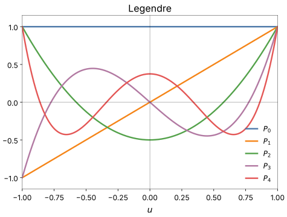
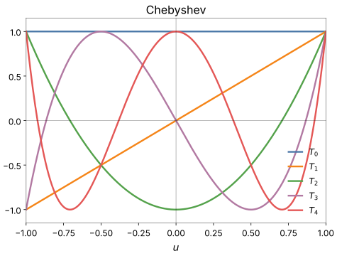

# Orthogonal polynomials

The `legendre` and `chebyshev` families build their design rows from
orthogonal polynomials of each input instead of plain powers. On $[-1, 1]$
these polynomials are bounded by 1 and stay distinct from each other as
the degree rises, so the least-squares problems for their weights stay well
conditioned where the [power basis](polynomial.md) does not.

## The design row

A neuron over `dim` inputs first squashes each input $x_k$ into
$u_k \in (-1, 1)$ (see [The squash](#the-squash)). Its design row is then

$$
\big[\ 1,\quad P_1(u_k), \dots, P_d(u_k)\ \text{for every input } k,\quad u_k u_l\ \text{for every pair } k < l\ \big]
$$

where $P_1, \dots, P_d$ are the family's polynomials up to the degree
$d$ = `degree`. That makes $1 + \text{dim} \cdot d + \binom{\text{dim}}{2}$
weights: 8 for a pair at degree 3, and 19 for four inputs at degree 3.

Each input gets its own polynomials, and inputs interact only through the
pairwise products $u_k u_l$. A full tensor product, every mixed term
$P_a(u_k) P_b(u_l) \cdots$, would have far more columns. Keeping only the
pairwise terms assumes that low-order interactions carry most of the
signal; the products can be switched off with `cross: false`.

## The polynomials

Both families follow a three-term recurrence from $P_0 = 1$ and $P_1 = u$:

- **Legendre** (`legendre`): $P_k(u) = \frac{2k-1}{k}\, u\, P_{k-1}(u) - \frac{k-1}{k}\, P_{k-2}(u)$.
  The polynomials are orthogonal under a uniform weight on $[-1, 1]$.
- **Chebyshev of the first kind** (`chebyshev`): $T_k(u) = 2u\, T_{k-1}(u) - T_{k-2}(u)$.
  They are orthogonal under the weight $1/\sqrt{1 - u^2}$, and a truncated
  Chebyshev expansion is close to the best approximation in the maximum
  error.

The first few, next to the plain powers they replace:

| $k$ | power basis | Legendre $P_k$ | Chebyshev $T_k$ |
|---|---|---|---|
| 0 | $1$ | $1$ | $1$ |
| 1 | $u$ | $u$ | $u$ |
| 2 | $u^2$ | $\tfrac{1}{2}(3u^2 - 1)$ | $2u^2 - 1$ |
| 3 | $u^3$ | $\tfrac{1}{2}(5u^3 - 3u)$ | $4u^3 - 3u$ |
| 4 | $u^4$ | $\tfrac{1}{8}(35u^4 - 30u^2 + 3)$ | $8u^4 - 8u^2 + 1$ |

Each $P_k$ and $T_k$ is a degree-$k$ polynomial, so a basis up to degree $d$
spans exactly the same functions as the plain powers $1, u, \dots, u^d$. The
families differ only in how the terms are combined, which is what keeps the
design matrix well conditioned where the raw powers do not.

On $[-1, 1]$ the two families look different. The Legendre polynomials
spread their oscillation across the interior and shrink toward the edges;
the Chebyshev polynomials keep a constant ripple all the way out, reaching
$\pm 1$ at $u = \pm 1$. Both stay within $[-1, 1]$, which is why the inputs
are squashed into that range first.

{ width="560" }

{ width="560" }

Legendre and Chebyshev span the same function space; which fits a given
dataset better is an empirical question, and on smooth data they often
perform similarly.

## The squash

The polynomials are bounded only on $[-1, 1]$; outside it they grow like
$u^d$. Every input therefore passes through a squash first, chosen by
`model.squash_method` or per entry.

**`sigma`** (the default) standardizes the input with its mean and standard
deviation, maps the band within `squash_n_sigma` standard deviations
linearly onto $\pm$`squash_core_range`, and saturates smoothly beyond it,
never reaching $\pm 1$. With the defaults (2 and 0.75):

| Standard deviations from the mean | Squashed value |
|---|---|
| 0 | 0 |
| 1 | 0.375 |
| 2 | 0.75 (edge of the linear band) |
| 3 | 0.936 |
| 4 | 0.973 |
| 5 | 0.985 |
| 10 | 0.997 |

The bulk of the data passes through undistorted, and outliers keep their
order without leaving $(-1, 1)$. The mean and standard deviation are those
of the layer's actual inputs, measured on the train split in one pass before
the layer trains (`Trainer.fit_layer_inputs`), separately for every input
of every candidate.

**`tanh`** needs no statistics, but it compresses the bulk: it is already at
0.762 one standard deviation out.

**`squash: false`** feeds the inputs unchanged, for inputs already inside
$[-1, 1]$.

Because the squash bounds the basis inputs, it mainly improves conditioning:
it tends to tighten the run-to-run spread and speed up the per-neuron fits,
usually with little effect on the central accuracy.

## Options

| Option | Default | Meaning |
|---|---|---|
| `degree` | 3 | highest polynomial degree per input |
| `dim` | 2 | inputs per neuron |
| `cross` | true | include the pairwise products $u_k u_l$ |
| `squash` | true | squash the inputs into $(-1, 1)$ |
| `squash_method` | `model.squash_method` (`sigma`) | `sigma` or `tanh` |
| `squash_n_sigma` | `model.squash_n_sigma` (2.0) | half-width of the linear band, in standard deviations |
| `squash_core_range` | `model.squash_core_range` (0.75) | squashed value at the band's edge, in $(0, 1)$ |
| `activation` | identity | output activation |

```yaml
model:
  ref_functions:
    - legendre:
        degree: 3
    - legendre:
        degree: 3
        dim: 4
```

Raising `degree` past 3 adds higher-order curvature but often brings little
on smooth data. Raising `dim` lets a single neuron model joint interactions
across more than two inputs, which the pairwise families reach only
indirectly; whether it helps depends on how much of the signal lives in
those interactions.

## In logs and plots

The short name joins the basis and the degree, with the number of inputs
when it is not 2: `Legendre3`, `Chebyshev4`, `Legendre3x4`.

## The knobs

`model.ref_functions` with the options above, `model.squash_method`,
`model.squash_n_sigma` and `model.squash_core_range`. See
[Configuration keys](../../reference/config.md).

<small>Checked against TorchSONN 0.1.5.</small>
