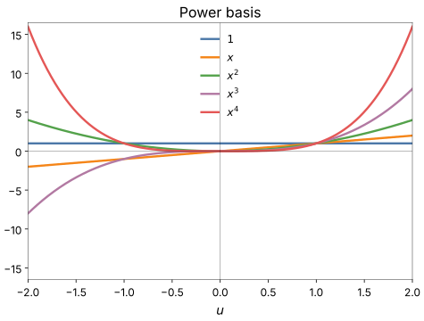

# Power-basis polynomials

The power-basis families build their design rows from plain powers and
products of their inputs. They are the partial descriptions of classical
GMDH (see [the Kolmogorov-Gabor polynomial](../kolmogorov-gabor.md)).

## The pair families

`linear`, `linear_cov`, `quadratic` and `cubic` read two inputs $x_i$ and
$x_j$:

| Family | Neuron | Weights |
|---|---|---|
| `linear` | $w_0 + w_1 x_i + w_2 x_j$ | 3 |
| `linear_cov` | $w_0 + w_1 x_i + w_2 x_j + w_3 x_i x_j$ | 4 |
| `quadratic` | $w_0 + w_1 x_i + w_2 x_j + w_3 x_i^2 + w_4 x_j^2 + w_5 x_i x_j$ | 6 |
| `cubic` | the `quadratic` terms $+\ w_6 x_i^3 + w_7 x_j^3$ | 8 |

`quadratic` holds every term up to degree 2. `cubic` adds the pure cubes
but not the mixed terms $x_i^2 x_j$ and $x_i x_j^2$. These families take no
options besides `activation`.

## polyquad: more than two inputs

`polyquad` is a degree-2 polynomial over `dim` inputs:

$$
y = w_0 + \sum_{k} w_k x_k + \sum_{k \le l} w_{kl}\, x_k x_l
$$

with `1 + dim + dim(dim+1)/2` weights: 21 at `dim: 5`.
With `squares: false`, the squares $x_k^2$ are left out and only the
cross products remain, which saves `dim` weights.

| Option | Default | Meaning |
|---|---|---|
| `dim` | 2 | inputs per neuron |
| `squares` | true | include the squared terms |
| `activation` | identity | output activation |

```yaml
model:
  ref_functions:
    - polyquad:
        dim: 5
        squares: true
```

A layer with $n$ inputs has $\binom{n}{\text{dim}}$ tuples, which grows fast
with `dim`: 16 inputs make 4,368 tuples of 5. `model.max_neuron_models`
caps how many a layer tries. With a `dim` above 2, `polyquad` needs that
cap: it cannot enumerate its tuples, and without the cap building the first
layer raises `NotImplementedError`.

## Conditioning and heavy tails

The power basis has a weakness that grows with the degree. Over a fixed
range, the powers $x, x^2, x^3, \dots$ look more and more alike as the
degree rises (odd powers resemble each other, and so do even ones), so
their columns become nearly collinear and the least-squares problem for
their weights becomes poorly conditioned. Heavy-tailed inputs make it worse: a feature 10
standard deviations out contributes $10^3$ to a cube term, and those few
rows dominate the fit. The power-basis families use their inputs as they
come, so this falls on the data preparation: standardize, and clip or
transform the far tails (see the
[regression quickstart](../../getting-started/quickstart-regression.md#2-standardize-and-clip-the-features)).

Both effects show up in the powers themselves. Near the origin the curves
bunch together, so their columns carry almost the same information; away
from it the high powers climb steeply, so a single far-out row can swamp
the rest.

{ width="560" }

The higher-degree families (`quadratic`, `cubic`) feel this most: the extra
terms they add are the ill-conditioned ones, so they can be less stable
across runs without being more accurate. The
[orthogonal families](orthogonal.md) avoid the problem by squashing each
input into $[-1, 1]$ and using a basis that stays well conditioned there.

## In logs and plots

The short names are `Linear`, `LinearCov`, `Quadratic`, `Cubic` and
`poly<dim>`, for example `poly5`.

## The knobs

`model.ref_functions` with the options above, and `model.max_neuron_models`.
See [Configuration keys](../../reference/config.md).

<small>Checked against TorchSONN 0.1.5.</small>
