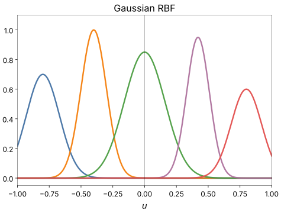

# Gaussian RBF

The polynomial families fit a *global* basis: every term is nonzero almost
everywhere. The `rbf` family fits a *local* one. Each neuron places $M$
Gaussian bumps over the space of its inputs and learns the weights of the
bumps together with where the bumps sit and how wide they are. Each bump is
active only near its own centre and fades away from it, so together they
cover the range in overlapping patches:

{ width="560" }

## The neuron

The neuron first standardizes each of its inputs with that input's mean and
standard deviation, giving $u$. Bump $m$, with centre $c_m$ and width $s_m$,
measures the scaled squared distance

$$
d_m(u) = \frac{\lVert u - c_m \rVert^2}{2 s_m^2} .
$$

By default the bump activations are normalized to sum to 1,

$$
\varphi_m(u) = \frac{e^{-d_m(u)}}{\sum_{k=1}^{M} e^{-d_k(u)}} ,
$$

so every row is a weighted blend of the bumps nearest to it, and rows far
from every centre still get a well-defined value. The design row is the $M$
bump activations followed by the standardized inputs themselves, a linear
part:

$$
\big[\ \varphi_1(u), \dots, \varphi_M(u),\ u_1, \dots, u_{\text{dim}}\ \big]
$$

That is $M + \text{dim}$ weights: 18 for a pair with the default 16 centres.
The normalized bumps already sum to 1, so no constant column is needed.
With `normalize: false` the plain Gaussians $e^{-d_m(u)}$ are used and a
constant column is added; with `linear: false` the linear part is dropped.

A network with `rbf` neurons is not a polynomial (see
[the Kolmogorov-Gabor polynomial](../kolmogorov-gabor.md)).

## Where the bumps start

Before a layer trains, the [input pass](../algorithm.md#3-input-pass)
places every candidate's bumps on a sample of that candidate's inputs from
the train split:

- **`placement: kmeans`** (default) runs k-means with $M$ clusters on the
  sample. The default start, **`seeding: pca_quantiles`**, takes the rows at
  evenly spaced quantiles along the first principal axis of the inputs. It
  depends on the data only, so the same data gives the same centres under
  any seed, making runs reproducible regardless of the seed.
  **`seeding: kmeans++`** draws a k-means++ start from the
  seeded generator instead. Lloyd iterations then refine the centres
  (`train.rbf_kmeans_iters`, 20 by default).
- **`placement: grid`** places the bumps on a grid of quantiles of each
  input, from the 10th to the 90th percentile, $K$ points per input. $M$
  must then be $K^{\text{dim}}$, for example 9, 16 or 25 for a pair.

The sample holds up to `train.input_sample_rows` rows (65,536 by default),
drawn uniformly from the split. `train.rbf_kmeans_mode` chooses what happens
next. With `sample`, k-means runs on the sample alone. With `stream`, the
start is taken on the sample and the centres are then refined by mini-batch
k-means over the whole split, `train.rbf_kmeans_passes` passes (1 by
default), one batch at a time. `auto`, the default, streams when the split
has more rows than the sample holds and uses the sample otherwise.

Each bump's starting width is `width` (1 by default) times its local
spacing, the mean distance from its centre to the two nearest other
centres.

## What the fit learns

The centres and widths are learned together with the weights, but each is
held near its start by a smooth bound:

$$
c_m = c^{0}_m + r_m \tanh\!\left(\frac{\lVert \delta_m \rVert}{r_m}\right) \frac{\delta_m}{\lVert \delta_m \rVert},
\qquad
s_m = s^{0}_m \exp\!\Big(L \tanh\!\big(\rho_m / L\big)\Big)
$$

Here $c^0_m$ and $s^0_m$ are the placed start, $\delta_m$ and $\rho_m$ the
learned parameters (zero at the start), $r_m$ is `center_radius` times the
bump's local spacing, and $L = \ln(\text{width\_band})$. A centre moves at
most $r_m$ from where k-means put it, and a width stays between
$1/\text{width\_band}$ and $\text{width\_band}$ times its start. The bound
is smooth, so unlike a hard clamp it keeps a gradient everywhere.

The bound keeps every bump on the data. With `center_radius: null` the
centres move freely; then the optimizer matters, since an unconstrained
centre can drift far into empty space and become a dead bump with no data
and no gradient. The LBFGS safeguards (`max_step`, `curvature_eps`) guard
against this; with them on, bounding the centres is a safety net rather than
an accuracy trade-off.

With `learn_centers: false` and `learn_widths: false`, the bumps stay where
they were placed and only the weights are fitted: a fixed-basis RBF.

## Options

| Option | Default | Meaning |
|---|---|---|
| `centers` | 16 | bumps per neuron, $M$; at least 2 |
| `dim` | 2 | inputs per neuron |
| `placement` | `kmeans` | `kmeans` or `grid` |
| `seeding` | `pca_quantiles` | k-means start: `pca_quantiles` or `kmeans++` |
| `width` | 1.0 | starting width, times the local spacing |
| `learn_centers` | true | learn the centres |
| `learn_widths` | true | learn the widths |
| `center_radius` | 2.0 | how far a centre may move, times the local spacing; `null` for no bound |
| `width_band` | 4.0 | widths stay within this factor of their start; must exceed 1 |
| `normalize` | true | normalize the bumps to sum to 1 |
| `linear` | true | add the standardized inputs to the design row |
| `standardize` | true | standardize the inputs before the bumps |
| `activation` | identity | output activation |

```yaml
model:
  ref_functions:
    - rbf:
        centers: 8
```

An RBF neuron carries one weight per bump plus the linear part, so an RBF
model tends to have many more parameters than a polynomial one of
comparable accuracy. The number of centres trades capacity for size:
more bumps fit finer local structure but enlarge the model, and past some
point add little on smooth data.

## In the log

The input pass logs one line per family when it places the centres: the
method, the cluster sizes (and how many clusters are empty), and the median
starting width and radius. After selection, the trainer logs how far the
survivors' centres moved from their start (in standard deviations), the
share of centres at their radius, and where the width scales sit, including
the share at the band's edge. A fit that never moves a centre, or pushes
everything against its bound, shows up there.

The short name is `RBF<M>`, with the number of inputs when it is not 2:
`RBF16`, `RBF8x3`.

## The knobs

`model.ref_functions` with the options above, `train.input_sample_rows`,
`train.rbf_kmeans_mode`, `train.rbf_kmeans_iters` and
`train.rbf_kmeans_passes`. See [Configuration keys](../../reference/config.md).

<small>Checked against TorchSONN 0.1.5.</small>
