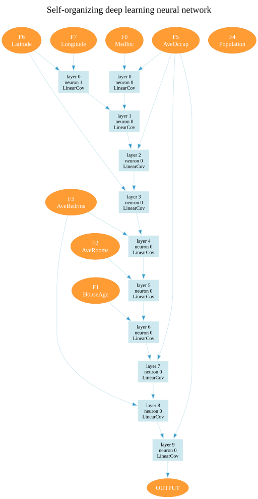

# Inspecting a model

A trained model is a small graph of polynomial neurons, and every part of
it can be read. This page shows how to draw the graph, read the layer
errors, list the features the model uses, look inside its neurons and read
the training log. The examples use the model of the
[regression quickstart](../getting-started/quickstart-regression.md).

## Drawing the network

`PlotModel` draws the network with Graphviz. It needs the `viz` extra and
the Graphviz programs (see [Installation](../getting-started/install.md)).

```python
from torchsonn.plot_model import PlotModel

trainer.prune(model)
PlotModel(model, "california", plot_neuron_name=True).plot()
```

`plot()` writes the drawing to `california.svg` and its Graphviz source to
`california`, in the current folder. `PlotModel(model, filename,
plot_neuron_name=False, view=False, title=...)` takes three options:
`plot_neuron_name=True` writes each neuron's family into its box,
`view=True` opens the drawing once it is written, and `title` sets the line
at the top of the drawing, "Self-organizing deep learning neural network"
by default (`None` leaves it out). Without the Graphviz
`dot` program on the PATH, `plot()` raises `RuntimeError`.

This is the quickstart's model after pruning, a California housing network
built from `linear_cov` reference functions:

{ width="440" }

- The orange ovals at the top are the input features: `F<i>` and the
  feature's name. The orange `OUTPUT` oval is the prediction.
- Each blue box is a neuron: its layer, its position in the layer and, with
  `plot_neuron_name`, its family's short name.
- An arrow runs from each input of a neuron to the neuron. An arrow from a
  feature into a deep layer comes from `model.shortcut.raw_features`; with
  `model.shortcut.prev_layers`, arrows also skip from older layers.
- The last arrow runs from the neuron that makes the prediction to
  `OUTPUT`. A model with an output head draws an `out_proj` box instead,
  with an arrow from every survivor it reads. A multi-class model with a
  projection per candidate and no head draws a `per-neuron projections`
  box, with an arrow from every survivor of its last layer.

Here each layer's neuron combines the neuron of the layer before with one
feature, a chain ten layers deep. `F4 Population` has no arrows: the model
does not use it.

Drawn before pruning, the diagram shows every survivor of every layer, 80
neurons for the quickstart, most of which never reach the output. Pruning
first shows only what the prediction uses.

## The layer errors

```python
print([round(e, 4) for e in model.layer_err])
```

```text
[0.4879, 0.3758, 0.3496, 0.3444, 0.3391, 0.3281, 0.3195, 0.3195, 0.3172, 0.3143]
```

`model.layer_err` holds the error of every layer the search trained, the
numbers the growth rule compared, including the layers it trained past the
best one and then discarded. `model.layer_val_err` holds the same for the
validation split, when `train` was given one, and is empty otherwise.

`model.plot_layer_error()` plots `layer_err` against the layer index with
matplotlib and marks the last layer kept. It needs the `viz` extra.

## Which features the model uses

```python
trainer.prune(model)
print(model.get_selected_features())
print(model.get_unselected_features())
```

```text
MedInc, HouseAge, AveRooms, AveBedrms, AveOccup, Latitude, Longitude
Population
```

Call these after `prune`. Before it, every survivor counts, including those
that never reach the output, and the quickstart's model lists all eight
features. `get_selected_features_indices()` and
`get_unselected_features_indices()` return column indices instead of
names. Names come from the `feature_names` given to `SONN`; without them,
the features read `index=inp_<i>`.

## Inside a layer

`model.layers` lists the layers. A layer holds one module per neuron
family, and each module holds that family's survivors as the rows of its
tensors.

```python
for i, layer in enumerate(model.layers):
    for module in layer:
        print(i, module.get_short_name(), tuple(module.weight.shape))
        for inputs in module.src_idxs.tolist():
            print("    reads", [model.locate(i, j) for j in inputs])
```

On the pruned quickstart model:

```text
0 LinearCov (2, 4)
    reads [(None, 0), (None, 5)]
    reads [(None, 6), (None, 7)]
1 LinearCov (1, 4)
    reads [(0, 0), (0, 1)]
2 LinearCov (1, 4)
    reads [(1, 0), (None, 5)]
...
```

- `module.weight` has one row of coefficients per neuron. For `linear_cov`
  these are $w_0, \dots, w_3$ of $w_0 + w_1 x_i + w_2 x_j + w_3 x_i x_j$;
  `module.get_name()` prints the family's formula.
- `module.src_idxs` gives, per neuron, the positions of its inputs within
  the layer's input.
- `model.locate(i, j)` turns position `j` of layer `i`'s input into a
  source and an index: source `None` is the input features, a number is
  the layer whose output it is. Above, layer 2's neuron combines the output
  of layer 1's neuron 0 with feature 5, `AveOccup`.
- `len(layer)` is the number of neurons in the layer, `layer.err` its error
  and `layer.err_values` its survivors' criterion values.

## The training log

Every run writes its log to `train.log` in its run folder,
`trainer.run_dir` (see [Training](training.md#the-runs-log)), and
`torchsonn.logger.setup_logger()` also shows it on the console. Each layer
of the quickstart logs:

```text
All models of LinearCovPolynomNeuron early stopped at step 80
LinearCovPolynomNeuron fit: 81 optimizer steps; 1.5% of updates capped at max_step, 0.0% of curvature pairs rejected
Current layer error: 0.488
Layer errors: [0.488]
Executed train layer #0 in 7.72 sec
Layer #0: error 0.4879, best 0.4879 at layer 0; first layer; 0 of 5 layers without improvement
```

- **`All models of ... early stopped at step`** marks the end of a
  family's fit by the early stop; **`... reached train.steps (N)`** marks a
  fit that the step budget ended.
- **`fit:`** counts the optimizer steps and, for LBFGS, how often its
  safeguards acted (see [Optimizers](optimizers.md#lbfgs)).
- **`Current layer error`** and **`Layer errors`** give the layer's error
  and those of the layers so far.
- **`Executed train layer`** is the layer's wall-clock time.
- **`Layer #k: error ...`** is the growth rule's verdict (see
  [Splits and stopping](../concepts/splits-and-stopping.md)).

Some settings add lines:

| Setting | Adds |
|---|---|
| a validation loader | a `Layer #k: dev ...` line per layer with the dev and validation errors and the gap between them |
| `train.layer_err_source: readout` | `Layer readout error (per-layer head on dev): ...; best-neuron error: ...` |
| an `rbf` family | where the input pass placed the centres, and how far the survivors moved them (see [Gaussian RBF](../concepts/neurons/rbf.md#in-the-log)) |
| `train.log_layer_diagnostics` | the survivors' correlations and effective rank (see [Survivor selection](../concepts/selection.md)) |
| `Trainer.train_out_proj` | `out_proj early stop at step ...` (`out_proj (lbfgs) ...` under LBFGS) when the head fit stops early |
| `Trainer.train_finetune` | how the end-to-end pass runs and `finetune early stop at step ...` |
| `keep_best_weights` | after each head fit, per-layer fine-tune or end-to-end pass, the step whose weights it kept (see [Heads and fine-tuning](../concepts/heads-and-finetune.md#last-step-or-best-evaluation)) |

A head fit or end-to-end pass whose log has no early-stop line ran to its
`max_steps`, and its result may not have converged.

<small>Checked against TorchSONN 0.1.5.</small>
