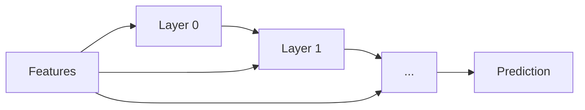

# TorchSONN

TorchSONN is a PyTorch library for building and training self-organizing
deep neural networks. The network grows one layer at a time. Each layer
builds candidate neurons, small functions of two or more inputs taken from
the previous layers' outputs and the original features. Every candidate is
fitted on the training split, and the ones with the lowest error on a
held-out split (by default, a separate dev split) survive into the next
layer. The search stops when adding layers stops lowering that error.

The neurons come from three families: plain polynomials, orthogonal
polynomials and Gaussian radial basis functions. Once the network has
grown, it can be refined: a linear output head combines the last layer's
survivors, and an end-to-end pass trains every parameter of the network at
once by gradient descent.

The result is a network you can read: every neuron is an explicit formula
over a few named inputs, and the whole network can be drawn as a graph.

## Neuron families

- **[Plain polynomials](concepts/neurons/polynomial.md)** in the power
  basis: `linear`, `linear_cov`, `quadratic`, `cubic` and the multi-input
  `polyquad`.
- **[Orthogonal polynomials](concepts/neurons/orthogonal.md)**: `legendre`
  and `chebyshev`, with a configurable degree and number of inputs. They
  stay well conditioned at higher degrees, where the raw power basis does
  not.
- **[Gaussian radial basis functions](concepts/neurons/rbf.md)**: `rbf`,
  local bumps whose centres and widths start from k-means and are then
  learned.

## How a model grows



Each layer fits its candidates on the train split and keeps the
`nbest_neurons` with the lowest dev error. Growth stops when the dev error
stops improving, and the model keeps the layers up to the best one. The
prediction is read off the grown network in one of two ways:

- **Best neuron** (default): the single last-layer survivor with the lowest
  dev error becomes the output. This is the classic GMDH read-out, and it
  keeps the model reducible to one explicit formula.
- **Linear head**: with `use_output_projection`, a linear layer combines
  several of the last layer's survivors into the prediction, which an
  end-to-end pass can then refine by training every parameter at once. This
  usually fits better, at the cost of the single-formula reading.

## A grown network

The network of the [CCPP tutorial](tutorials/ccpp.md), pruned to the
neurons that reach the output. Each box is a neuron, and its incoming edges
are the inputs it reads. `PlotModel` draws it (see
[Inspecting a model](guides/inspecting.md)); click the image for full size.

[{ width="100%" }](assets/img/ccpp_pruned_model.svg)

## Relation to GMDH

TorchSONN builds on the Group Method of Data Handling (GMDH) and on
[GmdhPy](https://github.com/kvoyager/GmdhPy), a scikit-learn-style GMDH
library. Two parts come from GMDH: the plain-polynomial neurons, and the
growth itself, which fits candidates layer by layer and keeps the best by
their error on a separate split. The orthogonal-polynomial and RBF neurons,
the output head, the fine-tuning passes and the training on a GPU go beyond
it. [GMDH](concepts/gmdh.md) describes the method.

## Example

California housing regression on the CPU:

```python
import numpy as np
from omegaconf import OmegaConf
from sklearn.datasets import fetch_california_housing
from sklearn.preprocessing import StandardScaler
from torch.utils.data import DataLoader
from torchsonn import SONN, SONNDataset, Trainer

# The rows come grouped by location, so shuffle before splitting:
# 50% train, 25% dev, 25% test; standardize on the train rows only.
x, y = fetch_california_housing(return_X_y=True)
order = np.random.default_rng(0).permutation(len(x))
x, y = x[order], y[order]
i_train, i_dev = int(0.50 * len(x)), int(0.75 * len(x))
x = StandardScaler().fit(x[:i_train]).transform(x).astype(np.float32)
# A few rows sit hundreds of standard deviations out (population, average
# occupancy); clip them so the polynomials do not extrapolate there.
x = np.clip(x, -5.0, 5.0)
y = y.astype(np.float32)

def loader(start, stop, shuffle=False):
    dataset = SONNDataset(x[start:stop], y[start:stop])
    # One batch holds a whole split (10,320 training rows).
    return DataLoader(dataset, batch_size=16384, shuffle=shuffle)

train_dl = loader(0, i_train, shuffle=True)
dev_dl = loader(i_train, i_dev)
test_dl = loader(i_dev, None)

# Only what differs from the defaults in torchsonn.config.SONNConfig.
config = OmegaConf.merge(SONN.default_config(), {
    "model": {
        "type": "regressor",
        "ref_functions": ["linear_cov"],
        "nbest_neurons": 8,
        "max_neuron_models": 28,
    },
    "train": {
        "max_layer_count": 10,
        "steps": 500,
        "eval_step_interval": 5,
        "early_stop_patience": 1e-4,
        "early_stop_tolerance_steps": 3,
        "checkpoint_dir": "checkpoints/california",
        "optimizer": {
            "name": "lbfgs",
            "optimizer_params": {
                "lr": 0.1, "min_lr": 0.01, "history_size": 10,
            },
        },
    },
})

Trainer.set_seed(config.train.seed)
model, trainer = SONN(config, d_model=x.shape[1]), Trainer(config)
trainer.train(model, train_dl, dev_dl, test_dl)
trainer.load_model_checkpoint(model, "cpu")
preds, targets = trainer.infer(model, test_dl)
print(f"test MSE: {((preds - targets) ** 2).mean().item():.4f}")
```

## Where next

- **To fit a model**: [install](getting-started/install.md) the package,
  work through a quickstart for
  [regression](getting-started/quickstart-regression.md) or
  [classification](getting-started/quickstart-classification.md), then use
  the [guides](guides/configuration.md) and the
  [configuration keys](reference/config.md).
- **If you know GMDH or polynomial networks**: start with
  [GMDH](concepts/gmdh.md), [the Kolmogorov-Gabor polynomial](concepts/kolmogorov-gabor.md)
  and [the algorithm](concepts/algorithm.md), then the
  [criteria](concepts/criteria.md) and [stopping rules](concepts/splits-and-stopping.md)
  with the exact formulas the code uses.
- **To work on the code**: the [API reference](reference/api/index.md).
