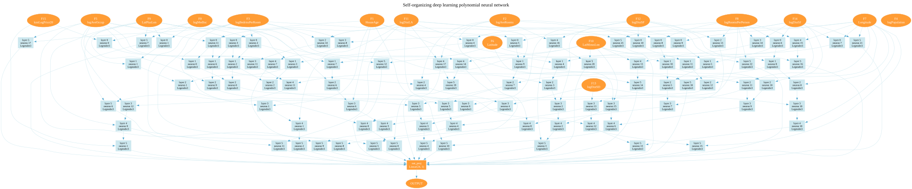
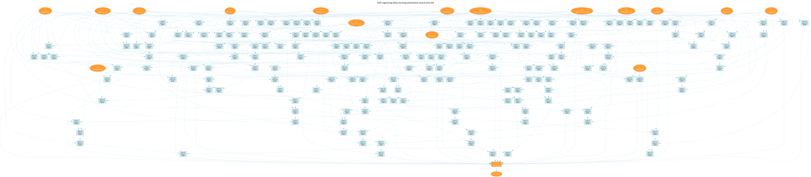

# California housing: torchsonn against gradient boosting

This tutorial fits a self-organizing neural network (SONN, a GMDH-style
polynomial network) to the California housing regression task. It then
compares the result with gradient-boosted trees on the same features and
the same split. This page covers the dataset, the published results, how
the tutorial's score improved, and where it stands against XGBoost.

## The dataset

California housing comes from Pace & Barry, *Sparse Spatial
Autoregressions* (Statistics & Probability Letters, 1997) [[1]](#ref-1). It is
built
from the 1990 US census. Each of its 20,640 rows is a census block group,
described by 8 numeric features:

| feature | meaning |
|---|---|
| MedInc | median income in the block group (tens of thousands of dollars) |
| HouseAge | median house age |
| AveRooms, AveBedrms | average rooms / bedrooms per household |
| Population, AveOccup | population, average household size |
| Latitude, Longitude | position of the block group |

The target is the median house value, in units of \$100,000. It is censored
at 5.0 (\$500k), and 4.8% of the rows sit on that cap. The tutorial loads
the StatLib copy through `sklearn.datasets.fetch_california_housing`.

**Kaggle.** The dataset did not come from a Kaggle competition. It is
older than Kaggle, and Kaggle hosts it in two forms:

- **The "California Housing Prices" dataset.** This is the version from
  Géron's *Hands-On Machine Learning* [[4]](#ref-4). It has raw room and bedroom totals,
  a categorical `ocean_proximity` column and some missing values. It is a
  dataset page with notebooks, not a competition, so it has no official
  leaderboard.
- **Playground Series S3E1, "Regression with a Tabular California Housing
  Dataset" (January 2023)** [[5]](#ref-5). This is a real competition, scored by RMSE.
  Its training and test data were *synthetic*, generated by a deep model
  trained on California housing. Its leaderboard numbers therefore don't
  carry over to the real data, and they are not used here.

## Published results

There is no single official benchmark. The most careful published numbers
come from the Yandex tabular deep learning papers [[2]](#ref-2) [[3]](#ref-3).
They tune every model on a validation split and report the test RMSE
averaged over 15 seeds, using the original 8 features on their own fixed
random split (20% test).

Two papers from other groups use the same protocol and confirm the
picture:

- **T2G-Former** [[7]](#ref-7) reuses that exact split, with 15 seeds.
- **ExcelFormer** [[8]](#ref-8) draws a random 80/20 split the same way,
  averaging 5 runs.

All numbers are single models:

| model | test RMSE | test MSE (RMSE²) | source |
|---|---|---|---|
| MLP | 0.499 | 0.249 | Gorishniy et al. 2023 (TabR) [[2]](#ref-2) |
| FT-Transformer | 0.459 | 0.211 | Gorishniy et al. 2021 [[3]](#ref-3) |
| FT-Transformer (tuned) | 0.468 | 0.219 | Chen et al. 2024 (ExcelFormer) [[8]](#ref-8) |
| T2G-Former | 0.455 | 0.207 | Yan et al. 2023 [[7]](#ref-7) |
| XGBoost (tuned) | 0.436 | 0.190 | Yan et al. 2023 [[7]](#ref-7) |
| XGBoost / CatBoost (tuned) | 0.436 | 0.190 | Chen et al. 2024 (ExcelFormer) [[8]](#ref-8) |
| LightGBM (tuned) | 0.434 | 0.188 | TabR paper [[2]](#ref-2) |
| XGBoost (tuned) | 0.432 | 0.187 | TabR paper [[2]](#ref-2) |
| ExcelFormer (mix-tuned) | 0.432 | 0.186 | Chen et al. 2024 (ExcelFormer) [[8]](#ref-8) |
| CatBoost (tuned) | 0.426 | 0.181 | TabR paper [[2]](#ref-2) |
| TabR-S | 0.403 | 0.162 | TabR paper [[2]](#ref-2) |
| **TabR (best single model)** | **0.400** | **0.160** | TabR paper [[2]](#ref-2) |

Two points matter for the comparison below:

- On the raw features, tuned gradient boosting lands at **0.426–0.436
  RMSE** (MSE ≈ 0.18–0.19) across three groups' papers. Transformer-style
  networks land at 0.455–0.468.
- Only two models beat the trees on this protocol: ExcelFormer (0.432),
  narrowly, and TabR (0.400).
- The best published single model, TabR [[2]](#ref-2), gets its edge by *retrieval*: it
  looks up the target values of the most similar training rows. The
  tutorial's kNN price feature does the same thing for location (see
  below).

These numbers come from a different split and a different feature set
from the tutorial's, so they set the scale, not a like-for-like target.
The fair comparison is the tree models run on the tutorial's own data,
in the last section.

## The tutorial's setup

- **Split.** A random 20% of the rows is held out as the test set (4,128
  rows, fixed for every run). The rest is split 3:1 into train (12,384
  rows), which fits the neurons, and dev (4,128 rows), which selects them.
- **Features (`tutorial.feature_engineering`).** There are 16 inputs:
  - logs of the skewed columns;
  - log bedrooms-per-room and log rooms-per-person;
  - coordinates rotated 45°;
  - log distance to Los Angeles, San Francisco, San Diego and San Jose;
  - the mean log price of the 20 nearest *training* blocks. This is
    leave-one-out on the training rows, so it doesn't leak the target.
- **Target and loss.** The model fits the raw price. The loss treats rows
  at the \$500k cap as censored, and predictions are clipped to the
  training range.
- **Metrics.** Test MSE and MAE on the 4,128 held-out rows, in (\$100k)²
  and \$100k.

Every setting is documented in `tutorial_params()` in
`california_housing.py`.

## How the score improved

All numbers are single-model test results, as recorded in the config
headers [[6]](#ref-6). Each row adds one change to
the row above it.

| step | test MSE | test MAE |
|---|---|---|
| Legendre baseline (gmdhpy-style, raw features, 50/50 split) | 0.3484 | 0.4184 |
| + linear head over the survivors, end-to-end fine-tune, prediction clip | 0.3002 | 0.3758 |
| + log features, log target | 0.3013 | 0.3626 |
| + location features (rotated coordinates, city distances, kNN price) | 0.2605 | 0.3307 |
| 60/20/20 split (train 12,384 rows) ¹ | 0.2160 | 0.2975 |
| per-layer fine-tune off, 16 survivors | 0.1972 | 0.2786 |
| decorrelated survivor selection (`omp_mixed`) | 0.1946 | 0.2731 |
| feature audit (log MedInc, bedrooms-per-room ratio) | 0.1920 | 0.2740 |
| censored loss at the \$500k cap | 0.1912 | 0.2719 |
| raw instead of log target (MSE favours the mean) | 0.1877 | 0.2791 |
| **24 survivors (mean of seeds 10–13)** | **0.1852 ± 0.0008** | **0.2775** |

¹ This step changes the test set. On the same 4,128 test rows, the model
from the row above scores 0.2650, so about 0.05 of this step's gain comes
from the extra training data.

The kNN price feature carries most of the location gain. Without it, the
first layer's error is 0.42; with it, 0.185.

## Experiments with different configs

Several dozen runs, each followed by seed repeats, tested the remaining
settings:

- neuron families and polynomial degree;
- candidate caps and survivor count;
- the survivor selection rule;
- the stop rules;
- the end-to-end learning rate.

**Seed noise.** A fixed seed repeats to 0.0004. Changing the seed changes
which candidate pairs are sampled, and that moves the test MSE by up to
0.009. A single-run difference under about 0.005 is therefore not a
finding.

**Seed-repeated results (seeds 10–13, test MSE / MAE):**

| configuration | mean MSE ± sd | mean MAE |
|---|---|---|
| Legendre-3, 16 survivors (old reference) | 0.1890 ± 0.0031 | 0.2793 |
| RBF-8, 16 survivors | 0.1909 ± 0.0016 | 0.2793 |
| Legendre + RBF-8, 16 survivors | 0.1898 ± 0.0022 | 0.2797 |
| Legendre-3, 32 survivors | 0.1851 ± 0.0023 | 0.2764 |
| Legendre + RBF-8, cap 500, 32 survivors | 0.1860 ± 0.0021 | **0.2753** |
| Legendre degree 5 | 0.1868 ± 0.0027 | 0.2788 |
| **Legendre-3, 24 survivors (current default)** | **0.1852 ± 0.0008** | 0.2775 |
| **RBF-8, 24 survivors (current default)** | **0.1853 ± 0.0014** | 0.2772 |

What the experiments found:

- **Survivor selection is the strongest lever.** Plain and `omp`
  selection cost 0.009–0.015.
- **A wider survivor pool is the one robust gain.** 32 survivors beat 16
  on every seed, and 24 survivors gave the same mean with the smallest
  spread. 48 survivors lose.
- **Everything else is inside the noise:**
  - polynomial degree 4 or 5;
  - Chebyshev instead of Legendre;
  - the linear neuron family;
  - RBF centre counts of 4 to 16;
  - grid or unbounded RBF centres;
  - the stop-rule variants.
- **Some changes are clear losses:**
  - dropping the head (+0.009);
  - the per-layer fine-tune;
  - a strong ridge on RBF weights;
  - a fixed RBF basis.

Legendre-3 and RBF-8 now tie at 0.185.

## Against gradient boosting, same data

The tree models and the MLP below are fitted on the tutorial's exact 16
features, the same train/dev/test rows and the same prediction clip. Each
model is reported as the mean ± standard deviation over several seeds.

"Learned parameters" counts everything the model learned:

- **Trees:** each split counts as 2 (the feature it splits on and the
  threshold), and each leaf value counts as 1.
- **MLP:** every weight and bias. 16 inputs → 64 hidden units → 1
  output gives 16·64 + 64 + 64 + 1 = 1,153.
- **SONN:** each Legendre neuron has 8 coefficients (a degree-3 polynomial
  of two inputs). Each RBF-8 neuron has 66: 18 weights, 16 centre
  coordinates and 16 widths. The 24→1 head has 25 weights. SONN models
  are counted after pruning to the neurons that reach the output.

The parameter column shows the smallest model among the seeds.

| model | seeds | mean test MSE ± sd | test RMSE | mean test MAE | learned parameters |
|---|---|---|---|---|---|
| sklearn HistGradientBoosting (lr 0.05, 31 leaves) | 0–4 | **0.1697 ± 0.0015** | 0.412 | 0.2649 | 22,477 ¹ |
| XGBoost (hist, depth 6, lr 0.05, early stop on dev) | 0–4 | 0.1719 ± 0 ² | 0.415 | **0.2632** | 52,257 ² |
| **torchsonn Legendre-3, 24 survivors** | 10–13 | 0.1852 ± 0.0008 | 0.430 | 0.2775 | **801** ³ |
| torchsonn RBF-8, 24 survivors | 10–13 | 0.1853 ± 0.0014 | 0.430 | 0.2772 | 6,485 ⁴ |
| MLP, one hidden layer of 64 units (SiLU) | 0–4 | 0.1905 ± 0.0012 | 0.436 | 0.2871 | 1,153 ⁵ |

¹ The seed changes HistGradientBoosting's internal early-stopping split.
The five models have 247–459 trees and 22,477–41,769 parameters.

² With no row or column subsampling, XGBoost is deterministic. Every seed
gives the same 339 trees and the same result.

³ The pruned models have 801, 1,009, 1,001 and 801 parameters (seeds
10–13). The 801-parameter seed-10 model is also the most accurate of the
four: test MSE 0.1841.

⁴ The pruned models have 8,185, 6,485, 9,953 and 8,049 parameters (seeds
10–13). The 6,485-parameter seed-11 model is also the most accurate:
test MSE 0.1830. RBF-8 matches Legendre-3 on accuracy, but it saves far
fewer parameters relative to the trees.

⁵ Wider single hidden layers barely help: 256 units give 0.1891 ± 0.0013
(4,609 parameters) and 1,024 units give 0.1894 ± 0.0010 (18,433
parameters). 16 units give 0.1918 ± 0.0032 (289 parameters).

Neither tree model nor the MLP was tuned beyond these settings.

**Reproducing the tree models.** The script below builds the tutorial's
features and split with the tutorial's own functions, then fits both
models. Run it from the repo root (`pip install xgboost` if needed). It
prints the per-seed numbers behind the table.

<details>
<summary>Show the script</summary>

```python
import numpy as np
import xgboost as xgb
from omegaconf import OmegaConf
from sklearn.datasets import fetch_california_housing
from sklearn.ensemble import HistGradientBoostingRegressor
from sklearn.metrics import mean_absolute_error, mean_squared_error
from sklearn.model_selection import train_test_split

from torchsonn.data.preprocessing import split_dataset
from tutorials.california_housing import california_housing as ch

# The tutorial's features and split: 16 inputs, 20% test, train/dev 3:1.
p = ch.tutorial_params(OmegaConf.create({"tutorial": {"feature_engineering": True}}))
data = fetch_california_housing()
X, names = ch.engineer_features(data.data.astype(np.float32), list(data.feature_names), p)
y = data.target.astype(np.float32)
X_rest, X_test, y_rest, y_test = train_test_split(X, y, test_size=p.test_size, random_state=42)
X_train, y_train, X_dev, y_dev = split_dataset(X_rest, y_rest, p.dev_split)

# kNN price feature, fitted on the training rows only.
ll = [names.index("Latitude"), names.index("Longitude")]
knn_train, knn_dev, knn_test = ch.knn_price_feature(
    X_train[:, ll], np.log(y_train), [X_dev[:, ll], X_test[:, ll]], p.knn_price_k)
X_train = np.column_stack([X_train, knn_train])
X_dev = np.column_stack([X_dev, knn_dev])
X_test = np.column_stack([X_test, knn_test])


def report(name, y_pred):
    y_pred = np.clip(y_pred, y_train.min(), y_train.max())  # same clip as the tutorial
    print(f"{name}: test MSE {mean_squared_error(y_test, y_pred):.4f}  "
          f"MAE {mean_absolute_error(y_test, y_pred):.4f}")


for seed in range(5):
    hgb = HistGradientBoostingRegressor(
        learning_rate=0.05, max_leaf_nodes=31, l2_regularization=1.0, min_samples_leaf=20,
        max_iter=5000, early_stopping=True, validation_fraction=0.15, n_iter_no_change=50,
        random_state=seed)
    hgb.fit(X_train, y_train)
    report(f"HistGradientBoosting, seed {seed}", hgb.predict(X_test))

booster = xgb.XGBRegressor(
    n_estimators=5000, learning_rate=0.05, max_depth=6, tree_method="hist",
    early_stopping_rounds=50, random_state=0)
booster.fit(X_train, y_train, eval_set=[(X_dev, y_dev)], verbose=False)
report("XGBoost", booster.predict(X_test, iteration_range=(0, booster.best_iteration + 1)))
```

</details>

**Reproducing the MLP.** The script below builds the same features and
split, standardizes the inputs on the training rows and fits a
single-hidden-layer MLP with PyTorch. It trains with AdamW and plain MSE,
halves the learning rate when the dev loss stalls, and stops early on dev,
keeping the best epoch. Run it from the repo root. It prints the per-seed
numbers behind the table (the numbers above came from a CUDA run).

<details>
<summary>Show the script</summary>

```python
import numpy as np
import torch
from omegaconf import OmegaConf
from sklearn.datasets import fetch_california_housing
from sklearn.metrics import mean_absolute_error, mean_squared_error
from sklearn.model_selection import train_test_split

from torchsonn.data.preprocessing import split_dataset
from tutorials.california_housing import california_housing as ch

# The tutorial's features and split: 16 inputs, 20% test, train/dev 3:1.
p = ch.tutorial_params(OmegaConf.create({"tutorial": {"feature_engineering": True}}))
data = fetch_california_housing()
X, names = ch.engineer_features(data.data.astype(np.float32), list(data.feature_names), p)
y = data.target.astype(np.float32)
X_rest, X_test, y_rest, y_test = train_test_split(X, y, test_size=p.test_size, random_state=42)
X_train, y_train, X_dev, y_dev = split_dataset(X_rest, y_rest, p.dev_split)

# kNN price feature, fitted on the training rows only.
ll = [names.index("Latitude"), names.index("Longitude")]
knn_train, knn_dev, knn_test = ch.knn_price_feature(
    X_train[:, ll], np.log(y_train), [X_dev[:, ll], X_test[:, ll]], p.knn_price_k)
X_train = np.column_stack([X_train, knn_train])
X_dev = np.column_stack([X_dev, knn_dev])
X_test = np.column_stack([X_test, knn_test])

# Standardize the inputs on the training rows.
device = "cuda" if torch.cuda.is_available() else "cpu"
mu, sd = X_train.mean(0), X_train.std(0) + 1e-8
Xtr, Xdv, Xte = (torch.tensor((a - mu) / sd, device=device) for a in (X_train, X_dev, X_test))
ytr, ydv = torch.tensor(y_train, device=device), torch.tensor(y_dev, device=device)


def report(name, y_pred):
    y_pred = np.clip(y_pred, y_train.min(), y_train.max())  # same clip as the tutorial
    print(f"{name}: test MSE {mean_squared_error(y_test, y_pred):.4f}  "
          f"MAE {mean_absolute_error(y_test, y_pred):.4f}")


def fit_mlp(hidden, seed, epochs=2000, patience=100, batch_size=256):
    torch.manual_seed(seed)
    model = torch.nn.Sequential(
        torch.nn.Linear(Xtr.shape[1], hidden), torch.nn.SiLU(), torch.nn.Linear(hidden, 1)).to(device)
    opt = torch.optim.AdamW(model.parameters(), lr=3e-3, weight_decay=1e-4)
    sched = torch.optim.lr_scheduler.ReduceLROnPlateau(opt, factor=0.5, patience=30)
    best, best_state, bad = float("inf"), None, 0
    for _ in range(epochs):
        model.train()
        perm = torch.randperm(len(Xtr), device=device)
        for i in range(0, len(Xtr), batch_size):
            idx = perm[i:i + batch_size]
            loss = ((model(Xtr[idx]).squeeze(1) - ytr[idx]) ** 2).mean()
            opt.zero_grad()
            loss.backward()
            opt.step()
        model.eval()
        with torch.no_grad():
            dev_mse = ((model(Xdv).squeeze(1) - ydv) ** 2).mean().item()
        sched.step(dev_mse)
        if dev_mse < best - 1e-6:  # early stop on dev, keep the best epoch
            best, bad = dev_mse, 0
            best_state = {k: v.clone() for k, v in model.state_dict().items()}
        else:
            bad += 1
            if bad > patience:
                break
    model.load_state_dict(best_state)
    with torch.no_grad():
        return model(Xte).squeeze(1).cpu().numpy()


for seed in range(5):
    report(f"MLP (64 hidden units), seed {seed}", fit_mlp(64, seed))
```

</details>

## The models

These are the pruned networks of two of the seed runs above, cut down to
the neurons that reach the output. Each box is a neuron, and its two
incoming edges are the inputs its polynomial reads. The final linear head
combines the 24 survivors of the last layer.

**Legendre-3, best model** (seed 10, test MSE 0.1841): 6 layers and 801
learned parameters after pruning. It uses 15 of the 16 inputs; only
`logPopulation` is left out. The unpruned network has 1,177 parameters:
[`unpruned_legendre_best.svg`](unpruned_legendre_best.svg).

<details open>
<summary>Pruned Legendre-3 network (click to expand; click the image for full size)</summary>

<a href="legendre_best_pruned.svg"></a>

</details>

**RBF-8, smallest model** (seed 11, test MSE 0.1830, also the most
accurate RBF-8 seed): 13 layers and 6,485 learned parameters after
pruning, using all 16 inputs. The unpruned network has 10,633 parameters:
[`unpruned_rbf8_smallest.svg`](unpruned_rbf8_smallest.svg).

<details>
<summary>Pruned RBF-8 network (click to expand; click the image for full size)</summary>

<a href="rbf8_smallest_pruned.svg"></a>

</details>

## Summary

torchsonn does not outperform gradient boosting on California housing.
On identical features and splits:

- the best tree model reaches a mean test MSE of **0.170**;
- torchsonn reaches **0.185**;
- a single-hidden-layer MLP reaches **0.191**.

That is a gap of 0.015 MSE, or about 0.018 RMSE (0.412 vs 0.430). No
seed of either torchsonn model reaches the trees' worst seed.

Over this project, torchsonn has closed most of that gap. The tutorial
started at 0.348 and now sits within 9% of the trees. Its 0.430 RMSE is
on a par with the tuned XGBoost and LightGBM numbers published for this
dataset (0.432 and 0.434, on their split and features) [[2]](#ref-2).

The Legendre model gets there with **about 30–65× fewer learned
parameters**: 801 polynomial coefficients after pruning, against 22,000
to 52,000 split thresholds and leaf values. The RBF-8 family reaches the
same accuracy, but with 6,500 parameters it is only 3–8× smaller than the
trees, so the saving belongs to the Legendre model.

The result is also *interpretable* and *trainable* in ways the tree
ensembles are not:

- every neuron is an explicit degree-3 polynomial of two named inputs;
- the network can be rendered as a graph (see [The models](#the-models));
- the script reports which input features the model actually uses;
- the whole network is differentiable, so it can be fine-tuned by
  gradient descent on new data. A tree ensemble's splits are fixed once
  grown; it can only be extended with more trees or retrained.

## References

1. <a id="ref-1"></a>R. K. Pace, R. Barry, *Sparse Spatial Autoregressions*,
   Statistics & Probability Letters 33 (1997) 291–297.
2. <a id="ref-2"></a>Y. Gorishniy et al., *TabR: Tabular Deep Learning Meets
   Nearest Neighbors* (2023): <https://arxiv.org/abs/2307.14338>
3. <a id="ref-3"></a>Y. Gorishniy et al., *Revisiting Deep Learning Models for
   Tabular Data* (2021): <https://arxiv.org/abs/2106.11959>
4. <a id="ref-4"></a>A. Géron, *Hands-On Machine Learning with Scikit-Learn and
   TensorFlow* (O'Reilly, 2017); its copy of the data on Kaggle:
   <https://www.kaggle.com/datasets/camnugent/california-housing-prices>
5. <a id="ref-5"></a>Kaggle Playground Series S3E1, *Regression with a Tabular
   California Housing Dataset*:
   <https://www.kaggle.com/competitions/playground-series-s3e1>
6. <a id="ref-6"></a>Tutorial history: the headers of
   [`california_housing_legendre_finetune.yaml`](california_housing_legendre_finetune.yaml)
   and [`california_housing_rbf.yaml`](california_housing_rbf.yaml).
7. <a id="ref-7"></a>J. Yan et al., *T2G-Former: Organizing Tabular Features into
   Relation Graphs Promotes Heterogeneous Feature Interaction* (AAAI 2023):
   <https://arxiv.org/abs/2211.16887>
8. <a id="ref-8"></a>J. Chen et al., *ExcelFormer: A Neural Network Surpassing
   GBDTs on Tabular Data* (KDD 2024):
   <https://arxiv.org/abs/2301.02819>
